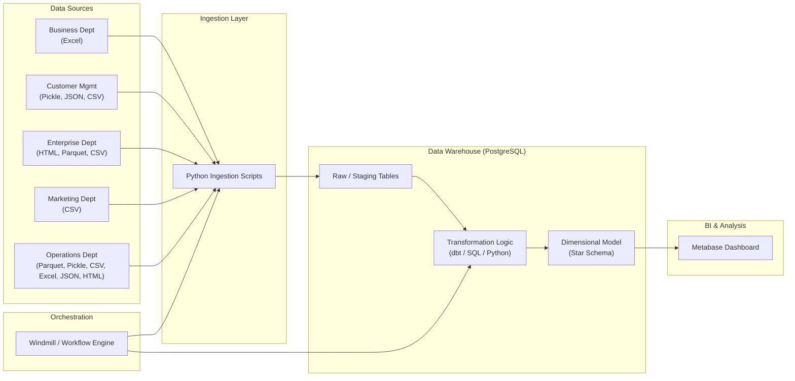
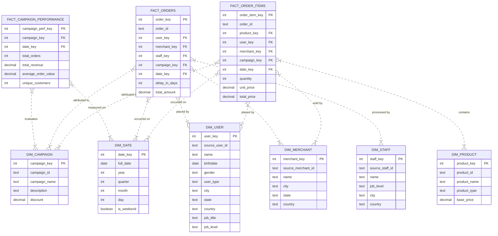

# Data Warehouse Architecture

## 1. High-Level Architecture

This Data Warehouse solution follows a modern ELT (Extract, Load, Transform) pipeline architecture designed to consolidate data from disparate departmental sources into a unified analytical store.

### Components
*   **Data Sources**: Diverse file formats (CSV, Excel, JSON, Parquet, Pickle, HTML) across multiple departments.
*   **Ingestion Layer**: Custom Python scripts responsible for reading raw files and loading them into the staging area of the warehouse.
*   **Storage & Warehousing**: PostgreSQL serves as the central data warehouse, hosting both raw staging data and the final dimensional models.
*   **Orchestration**: Windmill is used to schedule and manage the dependency graph of ingestion and transformation tasks.
*   **BI & Visualization**: Metabase connects to the Data Warehouse to provide insights, dashboards, and reporting capabilities.

---

## 2. Methodology

**Chosen Methodology: Kimball (Dimensional Modeling)**

We have adopted the **Kimball** methodology for this Data Warehouse. This approach focuses on delivering data that is understandable and fast to query for end-users.

*   **Bottom-Up Approach**: We build the warehouse by identifying key business processes and modeling them as **Fact** tables, surrounded by descriptive **Dimension** tables.
*   **Star Schema**: The physical implementation uses a Star Schema design to optimize for read performance and simplicity in reporting.
*   **Conformed Dimensions**: Shared dimensions (like `DIM_DATE`, `DIM_USER`, `DIM_PRODUCT`) are designed to be used across multiple facts, ensuring consistency in reporting across different business areas.

---

## 3. Data Models

### 3.1 Conceptual Data Model
At a high level, the business tracks **Orders** and **Campaign Performance**.

*   **Orders**: The central transaction event. It involves a *User* buying a *Product* from a *Merchant*, processed by a *Staff* member, potentially influenced by a *Campaign*.
*   **Campaign Performance**: Aggregated metrics tracking how well marketing campaigns are performing in terms of revenue and customer engagement.

### 3.2 Logical Data Model
*   **Facts**:
    *   `Fact_Orders`: Transactional facts containing metrics like `total_amount`, `delay_in_days`.
    *   `Fact_Order_Items`: Line-item details containing `quantity`, `unit_price`, `total_price`.
    *   `Fact_Campaign_Performance`: Aggregate facts containing `total_revenue`, `total_orders`.
*   **Dimensions**:
    *   `Dim_User`: Customer demographics (Name, City, Job).
    *   `Dim_Product`: Product catalog details (Name, Type, Base Price).
    *   `Dim_Merchant`: Seller information.
    *   `Dim_Staff`: Internal staff details.
    *   `Dim_Campaign`: Marketing campaign attributes (Discount, Description).
    *   `Dim_Date`: Calendar attributes for temporal analysis.

### 3.3 Physical Data Model (Star Schema)

The following Entity Relationship Diagram (ERD) represents the physical Star Schema implementation in the PostgreSQL Data Warehouse.

