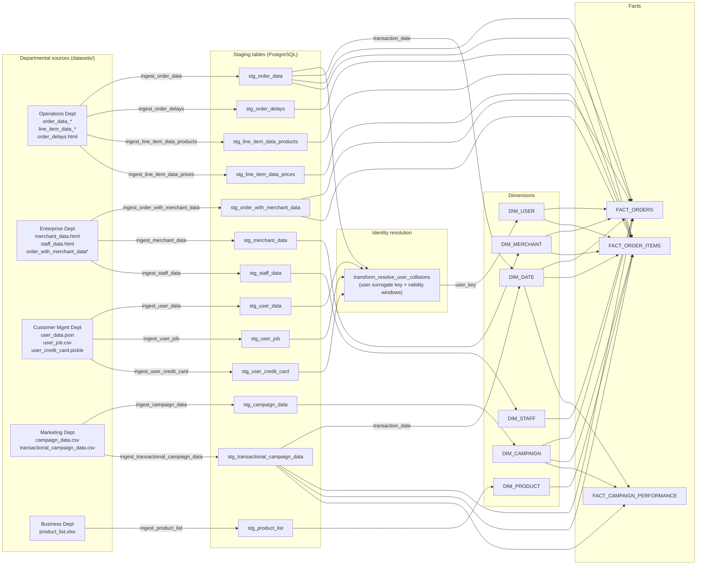

# Data Lineage (Source → Staging → Dimensional Model)

This appendix provides a high-level lineage map from departmental source files to staging tables and downstream dimensions/facts.

**Important:** This lineage is based on the implemented ingestion scripts under `scripts/ingestions/` and the star schema contract in `docs/star_schema.mermaid`.

---

## 1) Lineage map (overview)

---

## 2) Narrative lineage (by subject area)

### Orders analytics

- **Primary source:** Operations `order_data_*` files.
- **Staging:** `stg_order_data`.
- **Enrichment:**
  - Delay metrics from `stg_order_delays`.
  - Merchant/staff relationships from `stg_order_with_merchant_data`.
  - Campaign relationship from `stg_transactional_campaign_data`.
  - User surrogate key propagation from the identity resolution step.
- **Warehouse output:** `FACT_ORDERS`.

### Product / line-item analytics

- **Primary sources:** Operations `line_item_data_products*` and `line_item_data_prices*`.
- **Staging:** `stg_line_item_data_products`, `stg_line_item_data_prices`.
- **Reference data:** product master list loaded to `stg_product_list`.
- **Warehouse output:** `FACT_ORDER_ITEMS` joined to `DIM_PRODUCT`.

### Campaign analytics

- **Sources:**
  - Campaign attributes from `campaign_data.csv` → `stg_campaign_data` → `DIM_CAMPAIGN`.
  - Transactional campaign attribution from `transactional_campaign_data.csv` → `stg_transactional_campaign_data`.
- **Warehouse output:** `FACT_CAMPAIGN_PERFORMANCE` (aggregations by campaign and date).

### Customer/user analytics

- **Sources:** `user_data.json`, `user_job.csv`, `user_credit_card.pickle`.
- **Staging:** `stg_user_data`, `stg_user_job`, `stg_user_credit_card`.
- **Identity resolution:** a surrogate key + validity window approach establishes consistent user keys.
- **Warehouse output:** `DIM_USER` and consistent `user_key` references in facts.
