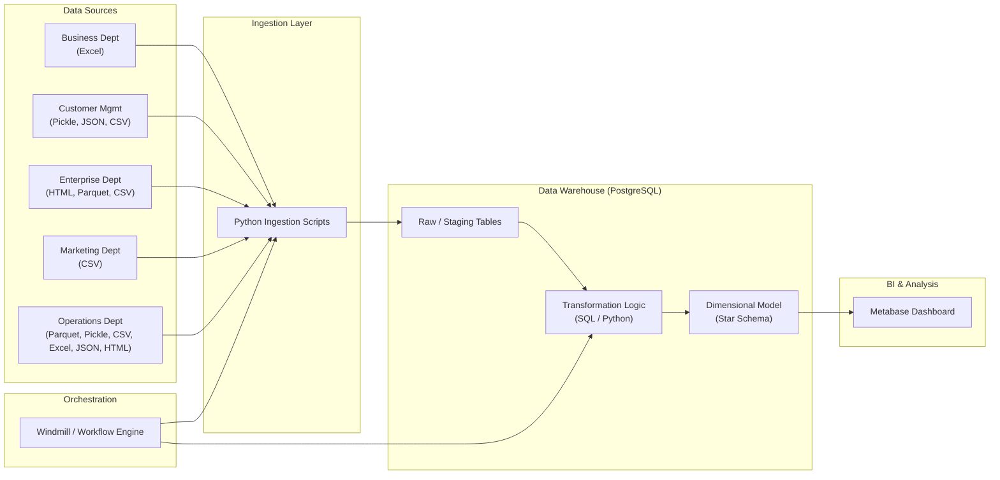

# Data Warehouse Technical Report

**Project:** Shopzada Data Warehouse (ELT pipeline)

**Document type:** Technical documentation / report (hybrid business + technical)

**Version:** 1.0

**Last updated:** 2025-12-16

---

## Document control

| Field | Value |
|---|---|
| Owner | Data Engineering Team |
| Reviewers | (Add names) |
| Status | Draft |

### Export / submission

If you need a PDF submission, a typical approach is to use Pandoc from the repository root:

```bash
pandoc docs/technical_report.md -o docs/technical_report.pdf
```

If Mermaid rendering is required in the exported PDF, either:

- Render the Mermaid diagrams separately and embed them as images, or
- Use a Markdown viewer/toolchain that supports Mermaid during export.

---

## Table of contents

1. [Executive summary](#1-executive-summary)
2. [Background & objectives](#2-background--objectives)
3. [Scope](#3-scope)
4. [Assumptions & constraints](#4-assumptions--constraints)
5. [Architecture overview](#5-architecture-overview)
6. [Data model overview](#6-data-model-overview)
7. [Methodology](#7-methodology)
8. [Security, privacy, and governance](#8-security-privacy-and-governance)
9. [Risks, limitations, and future work](#9-risks-limitations-and-future-work)
10. [Appendices](#10-appendices)

---

## 1. Executive summary

This project consolidates heterogeneous departmental datasets (CSV, XLSX, JSON, Parquet, Pickle, HTML) into a single analytical Data Warehouse implemented in PostgreSQL.

The solution implements an ELT pipeline:

- **Extract/Load (Ingestion):** Python scripts ingest raw departmental files into **staging tables**.
- **Transform:** dimensional modeling (Kimball) produces a **star schema** of conformed dimensions and fact tables.
- **Orchestration:** a workflow engine (Windmill) coordinates ingestion and transformations.
- **Consumption:** BI/reporting via Metabase.

Key deliverables:

- Architecture overview and pipeline description (this document).
- Star schema model contract (see `star_schema.mermaid`).
- Data dictionary (Appendix A: [Data dictionary](data_dictionary.md)).
- Lineage and implementation inventory (Appendix B/C: [Data lineage](data_lineage.md), [Implementation notes](implementation_notes.md)).
- Brief methodology, assumptions, and constraints.

---

## 2. Background & objectives

### 2.1 Background

Data is produced across multiple departments and delivered in inconsistent file formats and quality.

### 2.2 Objectives

- Provide a unified analytical view of the business’s core processes:
  - **Orders** (transactions)
  - **Campaign performance** (marketing effectiveness)
- Enable fast, simple BI queries using dimensional modeling.
- Improve data standardization and repeatability through scripted ingestion and orchestration.

---

## 3. Scope

### 3.1 In scope

- Loading departmental raw files into staging tables.
- Transforming staged data into a star schema:
  - Dimensions: `DIM_DATE`, `DIM_USER`, `DIM_PRODUCT`, `DIM_MERCHANT`, `DIM_STAFF`, `DIM_CAMPAIGN`
  - Facts: `FACT_ORDERS`, `FACT_ORDER_ITEMS`, `FACT_CAMPAIGN_PERFORMANCE`
- Orchestrating the end-to-end pipeline through a workflow definition.

### 3.2 Out of scope

- Real-time/streaming ingestion.
- Enterprise-grade MDM and full SCD coverage for all dimensions.
- Production hardening (HA, backup policies, monitoring/alerting) beyond project needs.

---

## 4. Assumptions & constraints

### 4.1 Data assumptions

- Business keys such as `order_id`, `product_id`, `merchant_id`, `staff_id`, `campaign_id` exist in their corresponding sources and can be standardized during ingestion.
- Source schemas are not fully consistent and may include junk columns (e.g., `Unnamed:*`); these are removed during ingestion.
- Date/time fields can be normalized into `DATE`/`TIMESTAMP` reliably enough for analytics.
- Campaign attribution to orders is derived from transactional campaign data; attribution semantics follow the source file’s meaning.

### 4.2 Identity resolution

- User records may collide/duplicate across sources; a surrogate key strategy is used for consistent analytics.
- Orders are mapped to the correct user surrogate key using a validity window (effective dating) approach.

### 4.3 Load strategy constraints

- Mixed source formats require Python-based parsing/cleaning.
- Many ingestion scripts **DROP & recreate** staging tables; others **TRUNCATE**. This simplifies repeatability but reduces native auditing unless additional logging is implemented.
- Warehouse loads are modeled as batch-style runs (not streaming).

---

## 5. Architecture overview

### 5.1 High-level architecture

The system follows a modern ELT architecture:



### 5.2 Key components

- **Data sources:** departmental flat files and semi-structured files.
- **Ingestion layer:** Python scripts (one per dataset/source) that standardize columns, clean fields, and load staging tables.
- **Storage & warehousing:** PostgreSQL hosts staging tables and the dimensional model.
- **Orchestration:** Windmill runs an ingestion+transform workflow.
- **BI:** Metabase provides dashboards and ad-hoc querying.

### 5.3 Orchestration overview

A workflow definition runs ingestion modules (often in parallel groups), then runs dimension builds, then fact builds.

Operationally, the flow is:

1. Parallelized ingestion groups (by subject area)
2. A cleaning/validation step (workflow references `f/clean/testing_cleaning_data_script`)
3. Parallelized dimension builds
4. Fact builds

See: `workflows/ingestion_flow_main.json` and Appendix: [Implementation notes](implementation_notes.md).

---

## 6. Data model overview

### 6.1 Conceptual model

At a high level, the business tracks:

- **Orders**: a user purchases products from merchants, possibly influenced by campaigns and processed by staff.
- **Campaign performance**: aggregated metrics measuring campaign outcomes.

### 6.2 Logical model

- **Facts**
  - `FACT_ORDERS`: order-level metrics (e.g., `total_amount`, `delay_in_days`).
  - `FACT_ORDER_ITEMS`: order line-items (e.g., `quantity`, `unit_price`, `total_price`).
  - `FACT_CAMPAIGN_PERFORMANCE`: campaign aggregates (e.g., `total_revenue`, `total_orders`).
- **Dimensions**
  - `DIM_USER`, `DIM_PRODUCT`, `DIM_MERCHANT`, `DIM_STAFF`, `DIM_CAMPAIGN`, `DIM_DATE`.

### 6.3 Physical star schema

The physical schema is documented as a Mermaid ERD.

- Canonical diagram: see `star_schema.mermaid`.
- Data dictionary: see Appendix: [Data dictionary](data_dictionary.md).
- Lineage mapping: see Appendix: [Data lineage](data_lineage.md).

---

## 7. Methodology

### 7.1 Dimensional modeling approach

The project adopts the **Kimball** methodology:

- **Bottom-up approach:** model core business processes as fact tables.
- **Star schema:** optimize for readability and BI performance.
- **Conformed dimensions:** share `DIM_DATE`, `DIM_USER`, `DIM_PRODUCT` across facts for consistent slicing.

### 7.2 ELT pipeline methodology

1. **Extract & Load:** ingestion scripts load to staging tables with standardized columns and basic data cleaning.
2. **Transform:** build dimensions first, then facts; enforce referential integrity with surrogate keys.
3. **Validate:** lightweight validations and deduplication guardrails at staging.

---

## 8. Security, privacy, and governance

- **PII/PCI-like fields:** credit card data is treated as sensitive and should not be exposed in BI.
- **Access control (recommended):** restrict staging tables and sensitive datasets; expose only curated dimensional models.
- **Data retention:** define retention windows for staging vs. curated models.

---

## 9. Risks, limitations, and future work

### 9.1 Risks

- Source data quality (schema drift, missing fields, inconsistent formatting).
- Staging “drop & recreate” patterns can complicate incremental loads and auditing.

### 9.2 Future work

- Improve incremental loading and change tracking.
- Add automated tests and data quality checks.
- Standardize naming: align staging table names and document table ownership.

---

## 10. Appendices

- Appendix A: [Data dictionary](data_dictionary.md)
- Appendix B: [Data lineage](data_lineage.md)
- Appendix C: [Implementation notes](implementation_notes.md)
